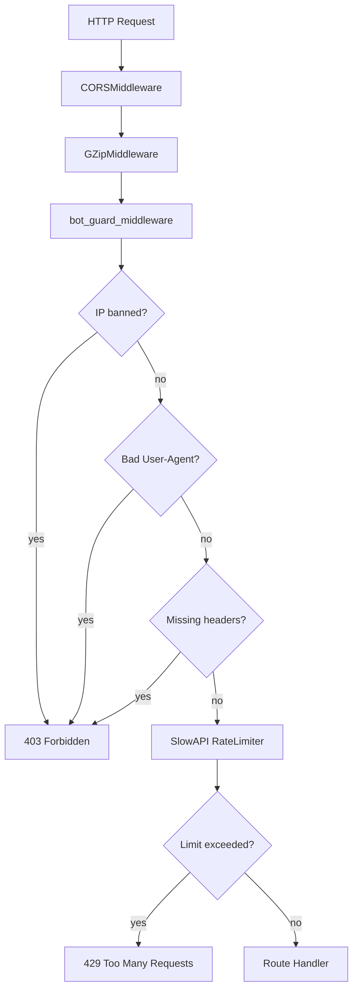

# NightOwl API — Architecture Flow Diagrams

Each file documents flow diagrams for one API domain.

| File | Endpoints |
|------|-----------|
| [auth.md](auth.md) | `POST /auth/google`, `POST /auth/facebook` |
| [books.md](books.md) | `GET /books`, `GET /books/search`, `GET /books/paged`, `GET /books/{id}`, `PATCH /books/{id}` |
| [chapters.md](chapters.md) | `GET /books/{id}/chapters`, `POST .../unlock`, `GET .../content` |
| [comments.md](comments.md) | `GET .../comment-counts`, `GET .../paragraphs/{pid}/comments`, `POST /comments/inline`, `DELETE /comments/inline/{id}` |
| [notifications.md](notifications.md) | `GET /notifications`, `PATCH /notifications/{id}/read`, `PATCH /notifications/read-all` |
| [user.md](user.md) | `GET/PUT /user/profile`, `POST/GET /user/linh-thach/*`, `POST /user/reading-progress`, `GET /user/reading-history` |
| [crawl.md](crawl.md) | `POST /crawl`, `POST /crawl/category`, `GET /crawl/category/jobs/*`, `GET /crawl/failed` |
| [tts.md](tts.md) | `GET/POST /tts/story/*` (status, generate, stream audio, clone voice) |
| [system.md](system.md) | `GET /health`, `GET /robots.txt`, `GET /api/internal/book-list-cache` (honeypot) |

## Middleware Stack (all requests)

