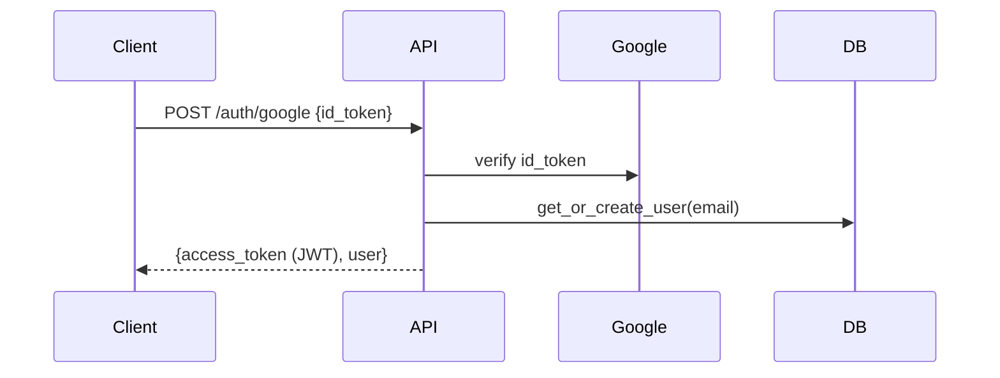
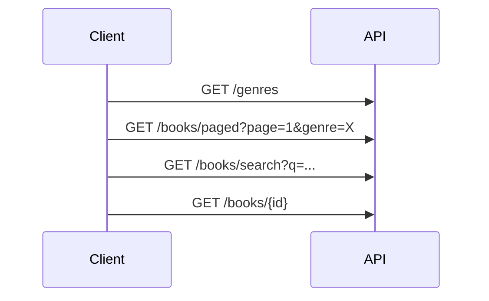
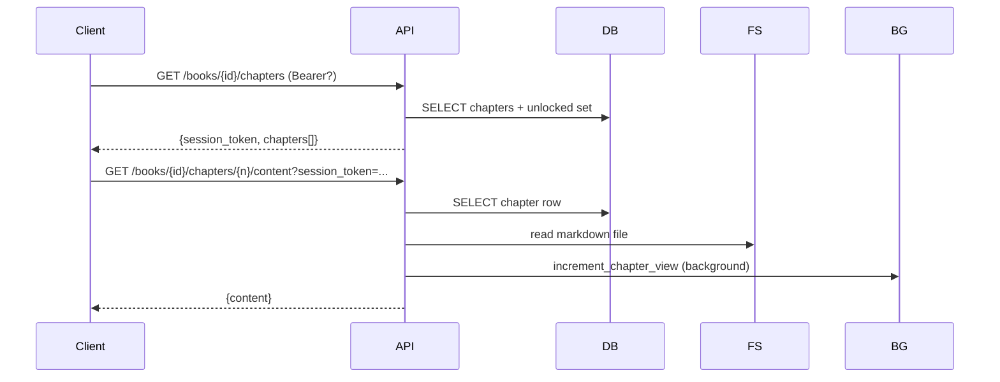
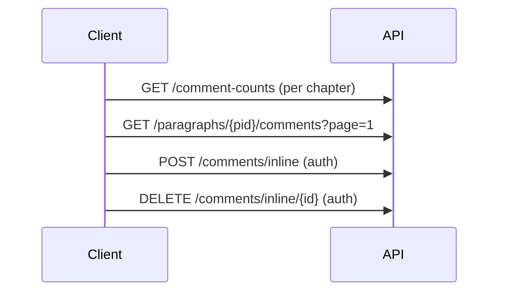
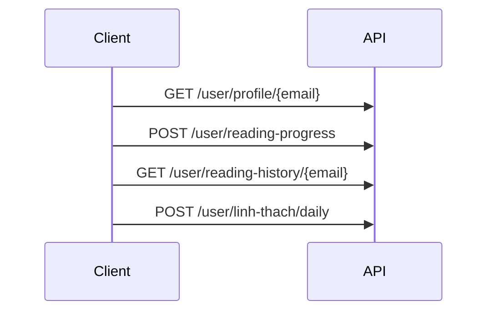
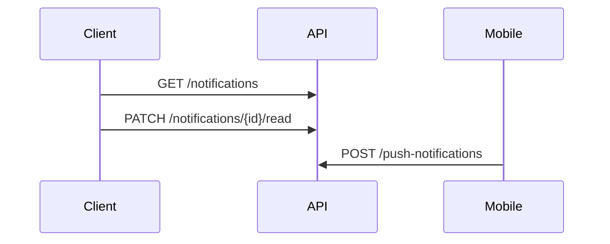
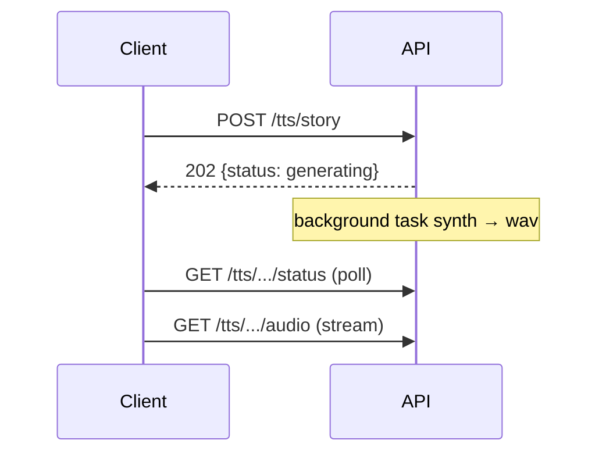
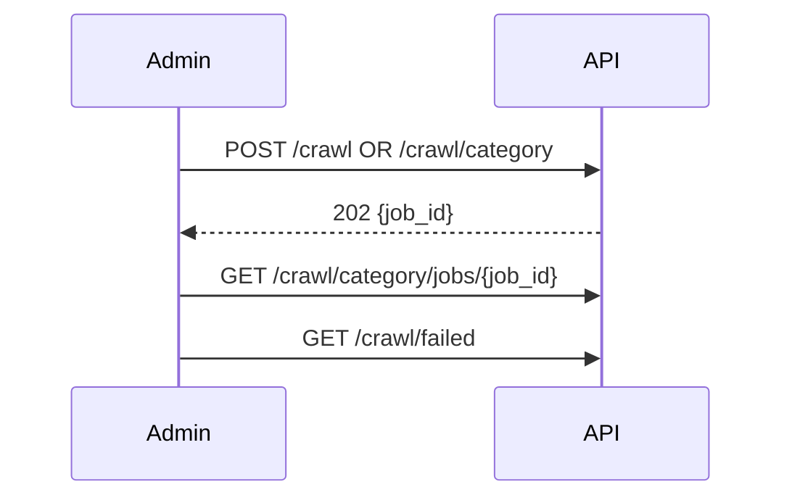

# API Sequences & Performance Hotspots

Document maps end-to-end API sequences for NightOwl backend (`app/main.py`) and flags endpoints that need optimization work.

Legend:
- 🔥 **HOT** — high QPS, on user-visible critical path → must be fast (<100ms p95)
- ⚠️ **SLOW-RISK** — known/likely bottleneck, needs optimization
- 🐢 **HEAVY** — long-running by design (crawl/TTS), should be async/background
- ✅ **OK** — low frequency or already optimized

---

## 1. Auth Flow

| Step | Endpoint | Status | Notes |
|------|----------|--------|-------|
| 1 | `POST /auth/google` | ✅ | One-shot, network bound on Google verify |
| 1' | `POST /auth/facebook` | ✅ | Same shape |

---

## 2. Browse / Discovery Flow

| Step | Endpoint | Status | Issue / Action |
|------|----------|--------|----------------|
| 1 | `GET /genres` | ⚠️ SLOW-RISK | `SELECT DISTINCT genre` full scan every call. **Cache in memory** (TTL 5–10min) — genres change rarely. |
| 2 | `GET /books` | ⚠️ SLOW-RISK | Returns **all rows**, no pagination. Old endpoint — frontend should migrate to `/books/paged`. Mark deprecated or add `LIMIT`. |
| 2' | `GET /books/paged` | 🔥 HOT | Already uses `run_in_threadpool` + paging. Verify indexes on `(genre, read_count)`, `(genre, rating)`, `(genre, chapter_count)`. Add composite indexes if missing. |
| 3 | `GET /books/search` | 🔥 HOT | FTS already used. Bottleneck on `COUNT(*)` for huge result sets — consider approximate count or skip total when `offset==0`. Add LIKE-fallback caching. |
| 4 | `GET /books/{id}` | ✅ | Primary-key lookup, fast. |

---

## 3. Read Flow (CRITICAL PATH)

| Step | Endpoint | Status | Issue / Action |
|------|----------|--------|----------------|
| 1 | `GET /books/{id}/chapters` | 🔥 HOT ⚠️ | Returns **all chapters** (no pagination). For 1000+ chapter novels this is heavy. **Add pagination** + sticky session token across pages. Add index `(book_id, chapter_number)`. |
| 2 | `POST /books/{id}/chapters/{n}/unlock` | ✅ | Write-path, infrequent. |
| 3 | `GET /books/{id}/chapters/{n}/content` | 🔥 HOT ⚠️ | File IO + DB + JWT decode every call. Optimizations:  • Cache file content (LRU, keyed by `book_id:chapter_number`, invalidate on re-crawl).  • Cache `unlocked_chapter_numbers` per user (TTL 60s).  • Skip view-increment for guests OR batch increments. |

---

## 4. Comment Flow

| Endpoint | Status | Issue / Action |
|----------|--------|----------------|
| `GET /books/{id}/chapters/{n}/comment-counts` | 🔥 HOT ⚠️ | Called on **every chapter open**. Currently 2 queries (chapter lookup + counts). **Merge into one query** or cache result per `chapter_id` (TTL 30s; invalidate on POST). Add index `(chapter_id, parent_id)` on `inline_comments`. |
| `GET /paragraphs/{pid}/comments` | 🔥 HOT | Paginated. Verify index `(chapter_id, paragraph_id, parent_id, created_at)`. Reply fan-out (N+1) — pre-fetch replies in one query grouped by parent. |
| `POST /comments/inline` | ✅ | Write-path. |
| `DELETE /comments/inline/{comment_id}` | ✅ | Write-path. |

---

## 5. User / Linh Thạch / Reading History

| Endpoint | Status | Issue / Action |
|----------|--------|----------------|
| `GET /user/profile/{email}` | ✅ | PK lookup. |
| `PUT /user/profile` | ✅ | Write. |
| `POST /user/linh-thach/purchase` | ✅ | Write. |
| `GET /user/linh-thach/history/{email}` | ✅ | Indexed on user_id. |
| `POST /user/linh-thach/daily` | ✅ | Write + daily check. |
| `POST /user/reading-progress` | 🔥 HOT | Called frequently (every chapter open). Make sure `(user_id, book_id)` UPSERT uses unique index — no lookup-then-write race. |
| `GET /user/reading-history/{email}` | ⚠️ SLOW-RISK | JOIN-heavy across `reading_progress + books + chapters`. Add `LIMIT` (default 50), index `(user_id, last_read DESC)`. Consider denormalizing book fields cached in `reading_progress`. |

---

## 6. Notifications

| Endpoint | Status | Issue / Action |
|----------|--------|----------------|
| `GET /notifications` | ⚠️ SLOW-RISK | `SELECT * ORDER BY id DESC` — **no LIMIT, no pagination**. Will grow unbounded. Add `LIMIT 50` + `?before_id=` cursor pagination. |
| `PATCH /notifications/{id}/read` | ✅ | Single update. |
| `PATCH /notifications/read-all` | ⚠️ | Full table update — should scope to a user when user_id column added. |
| `POST /push-notifications` | ✅ | Write, runs in threadpool. |

---

## 7. TTS Flow (Long-running)

| Endpoint | Status | Notes |
|----------|--------|-------|
| `POST /tts/story` | 🐢 HEAVY | Already background. OK. |
| `POST /tts/story/clone` | 🐢 HEAVY | Voice-clone, very slow. OK as background. |
| `GET /tts/.../status` | ✅ | File-stat check. |
| `GET /tts/.../audio` | ✅ | Streaming, range-supported. Verify chunk size 64KB ok for slow links. |

---

## 8. Crawl Admin Flow (Internal)

| Endpoint | Status | Notes |
|----------|--------|-------|
| `POST /crawl` | 🐢 HEAVY | Synchronous (awaits scraper). Consider 202 + background like `/crawl/category`. |
| `POST /crawl/category` | 🐢 HEAVY | Already 202. |
| `GET /crawl/category/jobs/{job_id}` | ✅ | In-memory lookup. |
| `GET /crawl/category/jobs` | ✅ | In-memory list. **Note:** lost on restart — persist if needed. |
| `GET /crawl/failed` | ✅ | Admin only, low QPS. |

---

## 9. Misc

| Endpoint | Status | Notes |
|----------|--------|-------|
| `GET /health` | ✅ | Trivial. |
| `GET /robots.txt` | ✅ | Static. |
| `GET /api/internal/book-list-cache` | ✅ | Honeypot. |

---

## Cross-cutting performance issues

### 1. Connection management
Every request opens/closes raw `pymysql` connection (`get_conn()` → `conn.close()`). Under load this is the single biggest latency tax.
**Action:** introduce a real pool (`DBUtils.PooledDB` or `aiomysql`). p50 wins: ~5–15ms per request.

### 2. Blocking DB calls on event loop
Most endpoints call `pymysql` directly (sync, blocks event loop) inside `async def`. Only a few use `run_in_threadpool` (`/books/paged`, `/push-notifications`, `/user/reading-progress`).
**Action:** wrap all sync DB calls in `run_in_threadpool`, or migrate to `aiomysql`. Critical on hot endpoints.

### 3. Bot guard middleware overhead
`bot_guard_middleware` runs on every request — IP check + UA check + header check.
**Action:** ensure `BANNED_IPS` lookup is O(1) set; profile.

### 4. Caching gaps
No in-process or external cache for:
- `/genres`
- `/books/paged` first page (most-visited)
- chapter-list responses
- comment-counts

**Action:** add `cachetools.TTLCache` for read-heavy endpoints; key by query params; ~30–60s TTL.

### 5. Index audit
Run `EXPLAIN` on hot queries:
- `books.read_count`, `books.rating`, `books.chapter_count` (sort fields)
- `chapters(book_id, chapter_number)` UNIQUE
- `inline_comments(chapter_id, parent_id, paragraph_id)`
- `reading_progress(user_id, last_read DESC)`

---

## Priority order for optimization

| Priority | Item | Expected gain |
|----------|------|---------------|
| P0 | Connection pool (`get_conn`) | -10ms global |
| P0 | Paginate `/books/{id}/chapters` | -200ms+ on long novels |
| P0 | Wrap sync DB in `run_in_threadpool` for hot endpoints | event-loop unblocked |
| P1 | Cache `/genres`, `/comment-counts` | -DB hits |
| P1 | LIMIT + cursor for `/notifications` | future-proof |
| P1 | Index audit + add composite indexes | -50ms on sort queries |
| P2 | Deprecate `/books` (unpaged), redirect to `/books/paged` | safety |
| P2 | Cache chapter file content (LRU 256MB) | -file IO |
| P2 | Batch view-count increments (in-memory buffer flushed every 10s) | -write QPS |
