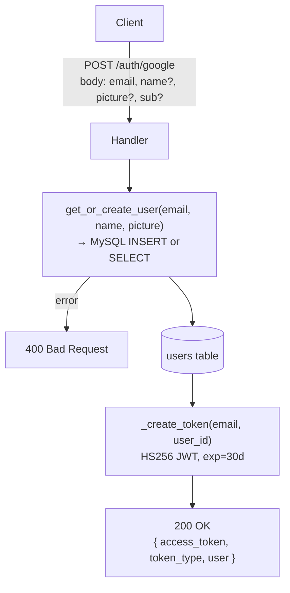
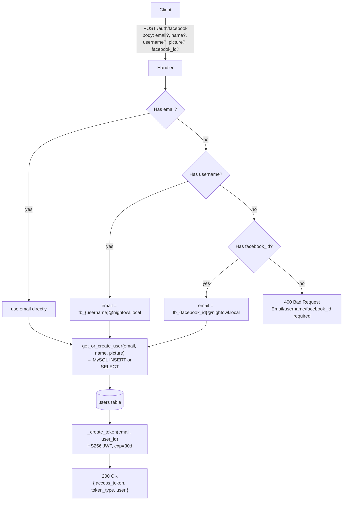
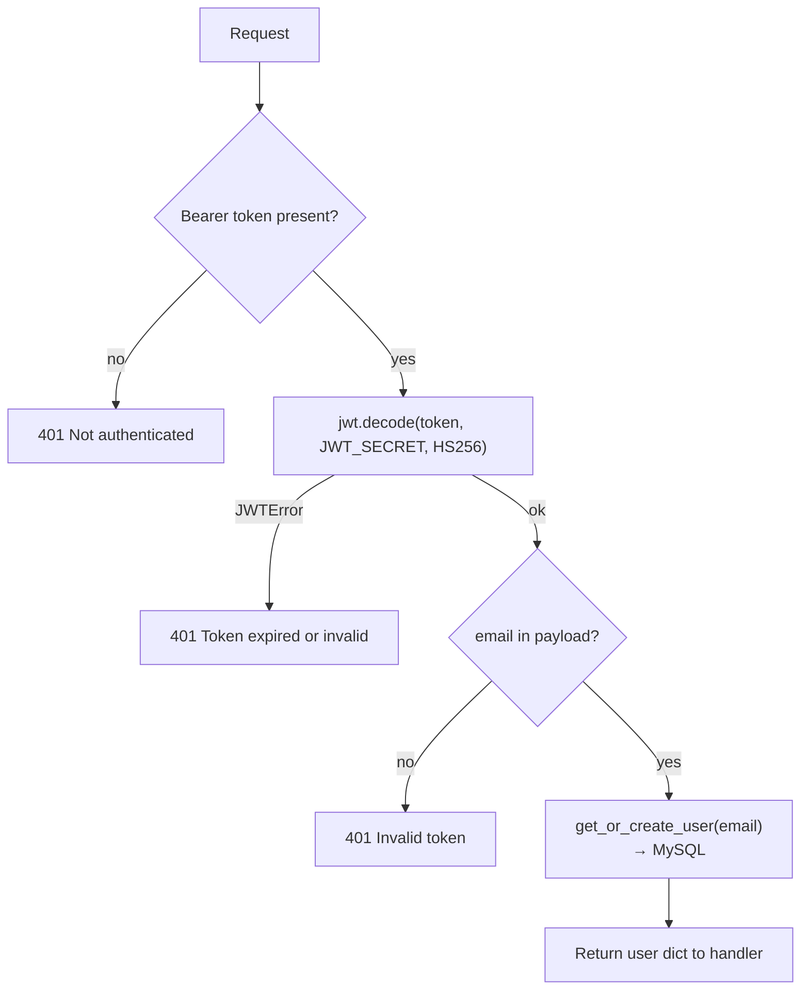

# Auth API Flow Diagrams

## POST /auth/google

Upsert user từ Google OAuth userinfo, trả JWT + profile.

**JWT payload:** `{ sub: email, uid: user_id, exp: now+30d }`

---

## POST /auth/facebook

Upsert user từ Facebook userinfo. Email synthetic nếu không có real email.

---

## JWT Validation (dependency: `get_current_user`)

Used by all protected endpoints via `Depends(get_current_user)`.

