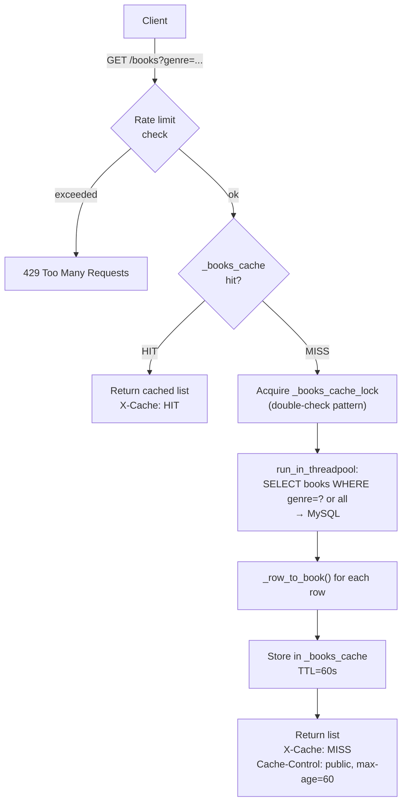
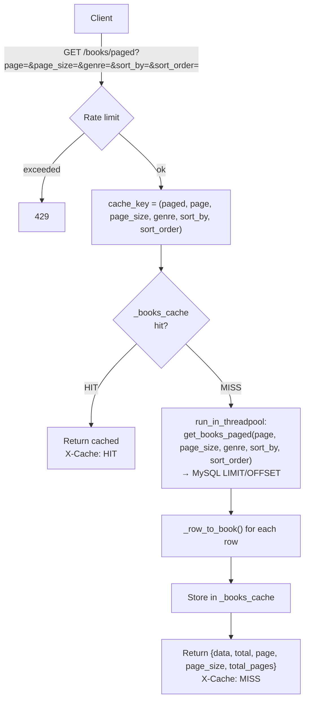

# Books API Flow Diagrams

## GET /books

List all books, optional genre filter. TTL-cached 60s in-memory.



---

## GET /books/search

Full-text + LIKE search with relevance ranking.

```mermaid
flowchart TD
    Client[Client] -->|GET /books/search?q=...&genre=?&limit=?&offset=?| RateLimit{Rate limit}
    RateLimit -- exceeded --> 429[429]
    RateLimit -- ok --> IsDigit{q is pure digit\n≤6 chars?}

    IsDigit -- yes --> IDLookup["SELECT * FROM books WHERE id = q"]
    IDLookup -- found --> ReturnID["Return {data:[book], total:1}"]
    IDLookup -- not found --> ShortQ

    IsDigit -- no --> ShortQ{len(q) ≤ 2?}
    ShortQ -- yes --> LikeSearch["LIKE search:\ntitle LIKE %q% OR author LIKE %q%\nORDER BY title starts-with first"]
    ShortQ -- no --> FTSearch["Full-text search (BOOLEAN MODE):\nMATCH(title,author,description,tags)\nAGAINST(q*)"]

    FTSearch --> FTCount{total > 0?}
    FTCount -- yes --> FTRanked["Re-query with score:\ntitle match * 3 + full match\nORDER BY _score DESC"]
    FTCount -- no --> LikeSearch

    LikeSearch --> Return
    FTRanked --> Return["Return {data, total, limit, offset}"]
```

---

## GET /books/paged

Paginated book list with sorting. TTL-cached per (page, page_size, genre, sort_by, sort_order).



---

## GET /books/{book_id}

Single book lookup — no cache.

```mermaid
flowchart TD
    Client[Client] -->|GET /books/{book_id}| Handler
    Handler --> DB["SELECT * FROM books WHERE id = book_id"]
    DB -- not found --> 404[404 Book not found]
    DB -- found --> Transform["_row_to_book(row)"]
    Transform --> Return[200 OK — book dict]
```

---

## PATCH /books/{book_id}

Update title, author, and/or free_chapter_threshold. Invalidates cache.

```mermaid
flowchart TD
    Client[Client] -->|PATCH /books/{book_id}\nbody: title?, author?, free_chapter_threshold?| Handler
    Handler --> Validate{At least one\nfield provided?}
    Validate -- no --> 400[400 Bad Request]
    Validate -- yes --> UpdateDB["run_in_threadpool:\nupdate_book(book_id, title, author, threshold)\n→ MySQL UPDATE books + chapters.free flags"]
    UpdateDB -- book not found --> 404[404]
    UpdateDB -- ok --> InvalidateCache["_invalidate_books_cache()\nclears _books_cache + _content_cache"]
    InvalidateCache --> Return["200 OK\n{id, title, author, free_chapters}"]
```
