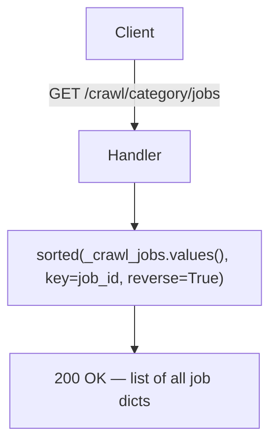
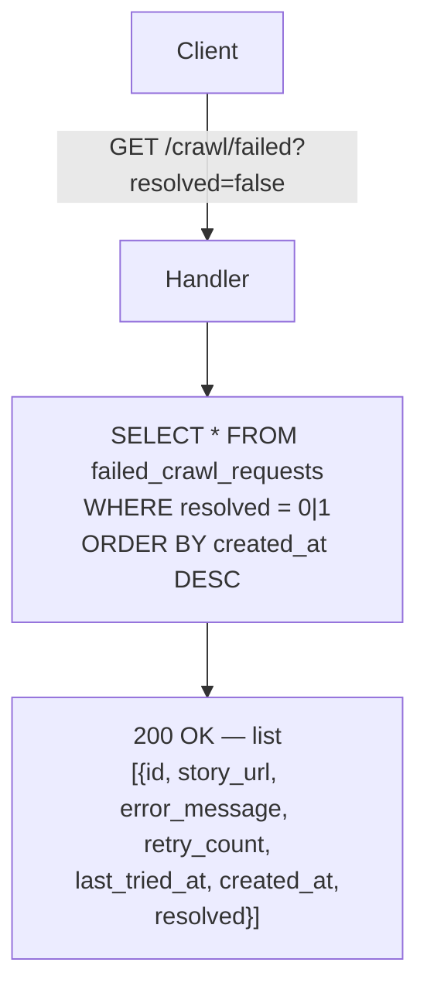
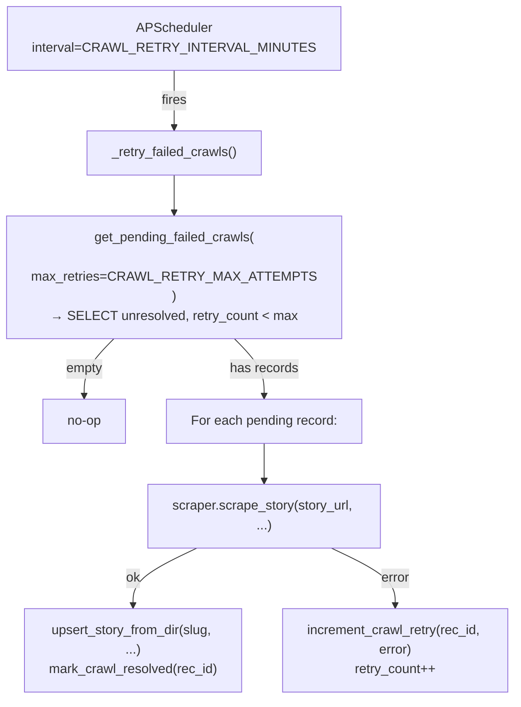

# Crawl API Flow Diagrams

---

## POST /crawl

Crawl single story or listing page, upsert to DB. On failure → save to `failed_crawl_requests` for retry.

```mermaid
flowchart TD
    Client[Client] -->|POST /crawl\nbody: {story_url, story_limit?, start_story_from, free_chapter_threshold}| Handler

    Handler --> Scrape["await scraper.scrape_story(\n  story_url, story_limit, start_story_from\n)\n→ crawl4ai + Playwright"]

    Scrape -- ValueError --> 400[400 Bad Request]
    Scrape -- Exception --> SaveFailed["save_failed_crawl(\n  story_url, error, limits, threshold\n)\n→ MySQL failed_crawl_requests"]
    SaveFailed --> 500[500 Crawl error]

    Scrape -- ok --> ModeCheck{result.mode?}

    ModeCheck -- single_story --> UpsertSingle["upsert_story_from_dir(\n  slug, free_chapter_threshold,\n  source_url, meta...\n)\n→ MySQL: INSERT/UPDATE books + chapters\n→ sync markdown files → DB"]
    ModeCheck -- listing_page --> LoopStories["For each story in result.stories:\n  upsert_story_from_dir(slug, ...)\n  skip errors silently"]

    UpsertSingle --> Return
    LoopStories --> Return["200 OK\n{mode, story_slug, chapter_count,\n new_chapter_count, db_upsert, ...}"]
```

---

## POST /crawl/category

Background-mode batch crawl of a listing page. Skips slugs already in DB.

```mermaid
flowchart TD
    Client[Client] -->|POST /crawl/category\nbody: {listing_url, target_count, free_chapter_threshold, concurrency}| Handler

    Handler --> CreateJob["Generate job_id (uuid hex 10)\n_crawl_jobs[job_id] = {status:running, ...}"]
    CreateJob --> SpawnBg["BackgroundTasks.add_task(\n  _run_category_crawl, job_id, req\n)"]
    SpawnBg --> Return202["202 Accepted\n{job_id, status:running, poll: /crawl/category/jobs/{job_id}}"]

    SpawnBg -.->|background| BgRunner

    subgraph BgRunner["_run_category_crawl (background)"]
        Phase1["Phase: collecting_urls\n_collect_story_urls_from_listing(listing_url)\n→ Playwright scrape listing pages"]
        Phase1 --> FilterExisting["get_existing_slugs(slugs)\n→ filter out slugs already in DB"]
        FilterExisting --> NoNew{new_urls empty?}
        NoNew -- yes --> DoneEarly["status=done\nmessage: all already in DB"]
        NoNew -- no --> ParallelCrawl["Phase: crawling\nSemaphore(concurrency) + jitter delay\nasyncio.gather up to target_count*3 candidates"]
        ParallelCrawl --> EachURL["For each URL:\n  scraper.scrape_story(url)\n  → upsert_story_from_dir(slug, ...)\n  success_count++\n  if success_count >= target_count → stop_event.set()"]
        EachURL --> Done["status=done\nmessage: Hoàn thành X/target truyện mới"]
    end
```

---

## GET /crawl/category/jobs/{job_id}

Poll job status for a running/completed category crawl.

```mermaid
flowchart TD
    Client[Client] -->|GET /crawl/category/jobs/{job_id}| Handler
    Handler --> Lookup{job_id in\n_crawl_jobs?}
    Lookup -- no --> 404[404 Job not found]
    Lookup -- yes --> Return["200 OK — full job dict\n{job_id, status, phase, done, total_in_listing,\n already_in_db, new_available, results, errors, message}"]
```

---

## GET /crawl/category/jobs

List all in-memory category crawl jobs (lost on server restart).



---

## GET /crawl/failed

List failed crawl requests pending retry.



---

## Background: Crawl Retry Scheduler

Runs every `CRAWL_RETRY_INTERVAL_MINUTES`. Retries pending failed crawls up to `CRAWL_RETRY_MAX_ATTEMPTS`.


