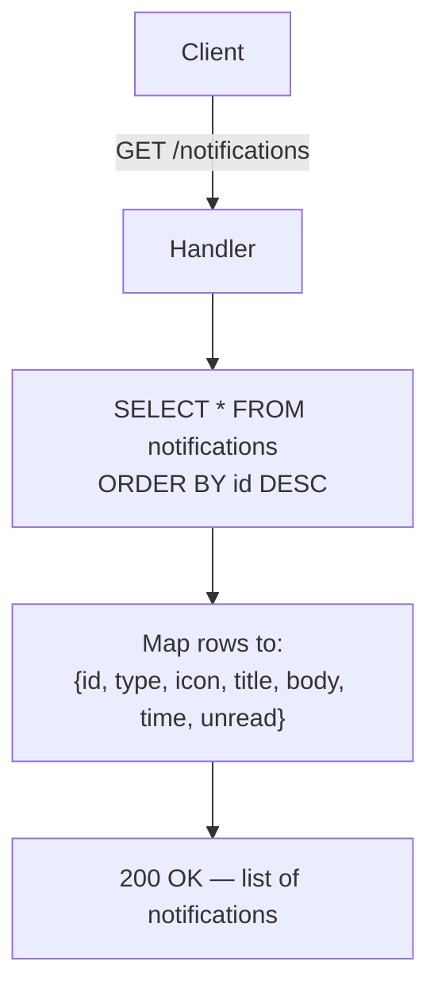
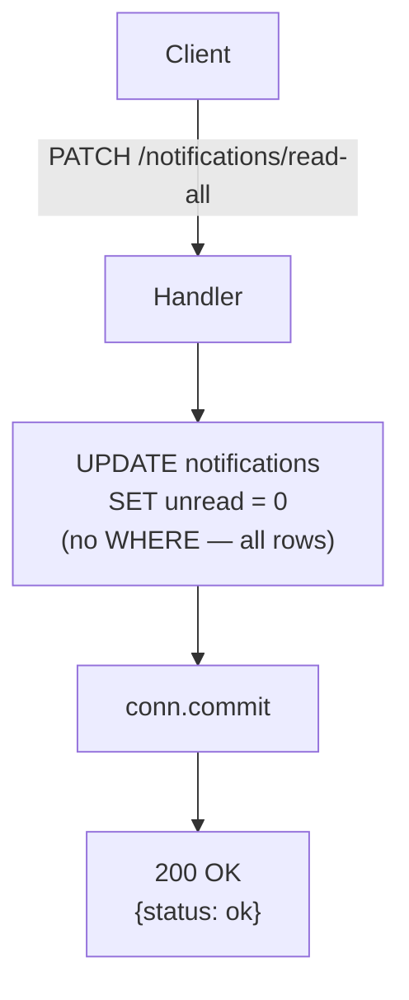

# Notifications API Flow Diagrams

Simple CRUD for notification bell. No auth required.

---

## GET /notifications

Fetch all notifications ordered newest first.



---

## PATCH /notifications/{notif_id}/read

Mark single notification as read.

```mermaid
flowchart TD
    Client[Client] -->|PATCH /notifications/{notif_id}/read| Handler
    Handler --> DB["UPDATE notifications\nSET unread = 0\nWHERE id = notif_id"]
    DB --> Commit[conn.commit]
    Commit --> Return["200 OK\n{status: ok}"]
```

> Note: no 404 guard — silent no-op if ID doesn't exist.

---

## PATCH /notifications/read-all

Mark all notifications as read.


