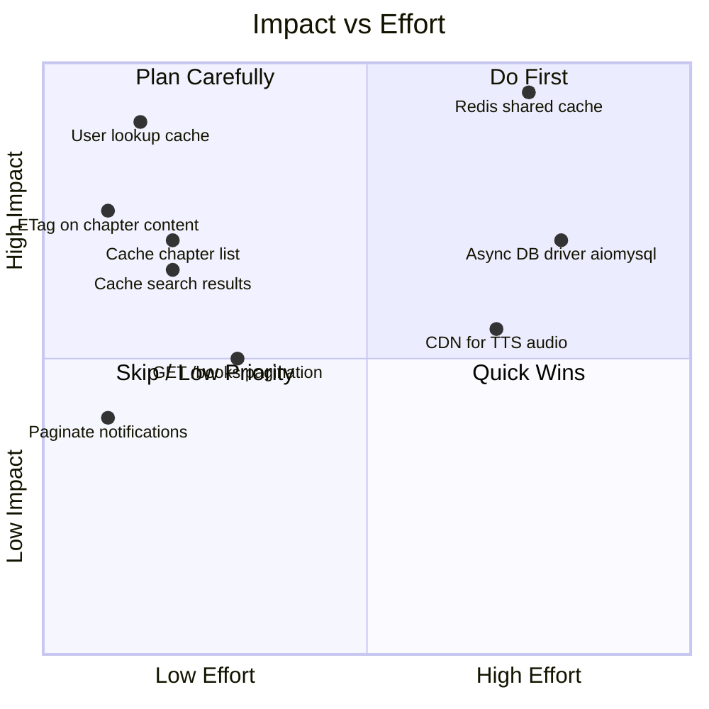
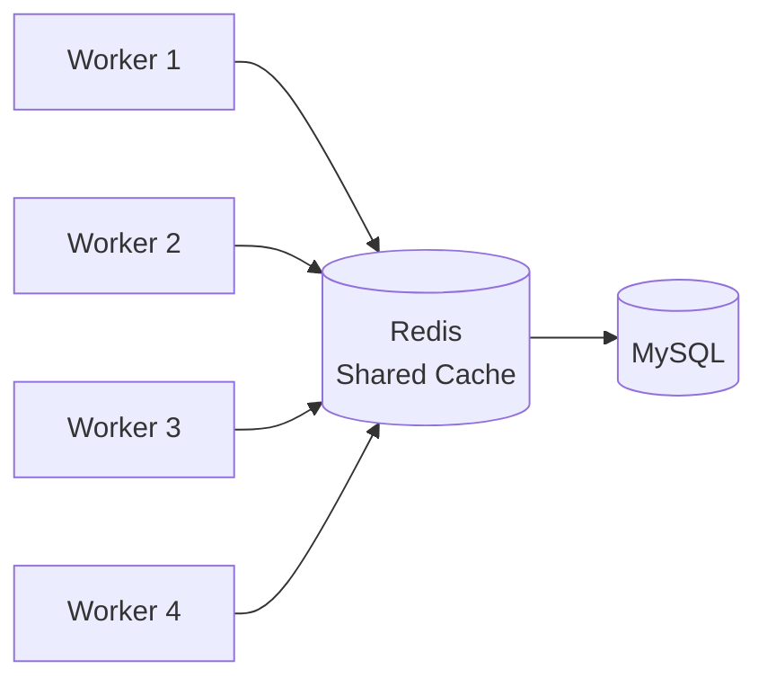
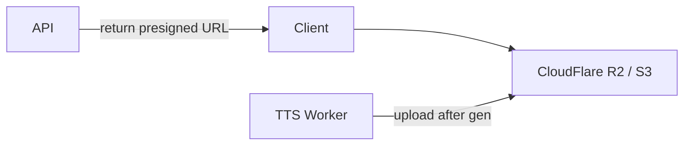
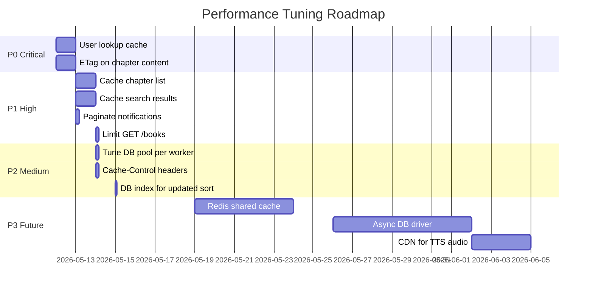

# NightOwl API — Performance Tuning Plan

Analyzed from flow diagrams in this directory. Bottlenecks ranked by impact.

---

## Current State Assessment

| Layer | Status |
|-------|--------|
| DB connection pool | ✅ PooledDB (mincached=2, maxcached=10, maxconn=20) |
| Books list cache | ✅ TTLCache 60s in-memory |
| Content cache | ✅ TTLCache 30min in-memory |
| DB indexes | ✅ FTS, composite indexes well-covered |
| GZip | ✅ Middleware applied |
| Chapter view increment | ✅ BackgroundTask (non-blocking) |
| Category crawl | ✅ BackgroundTask + semaphore |
| **User lookup per auth request** | ❌ DB hit on every protected endpoint |
| **Cache not shared across workers** | ❌ In-memory only — multi-worker = N separate caches |
| **Chapter list not cached** | ❌ DB hit every time |
| **Search not cached** | ❌ DB + FTS on every query |
| **Notifications unbounded** | ❌ SELECT all, no LIMIT |
| **`GET /books` no pagination** | ❌ Returns full table |
| **Chapter content: no HTTP cache headers** | ❌ Browser re-fetches unchanged content |

---

## Priority Queue



---

## P0 — Critical (do first)

### P0-1: Cache user record in `get_current_user`

**Problem:** `get_current_user` dependency calls `get_or_create_user(email)` → MySQL SELECT on **every** authenticated request. With 10 protected endpoints, each user action fires a full round-trip.

**Fix:** TTLCache keyed on `email`, TTL=60s.

```python
# In main.py — add after existing caches
from cachetools import TTLCache
_user_cache: TTLCache = TTLCache(maxsize=2048, ttl=60)
_user_cache_lock = asyncio.Lock()

def get_current_user(creds=Depends(_bearer)) -> dict:
    if not creds:
        raise HTTPException(status_code=401, detail="Not authenticated")
    try:
        payload = jwt.decode(creds.credentials, JWT_SECRET, algorithms=[JWT_ALGORITHM])
        email: str = payload.get("sub", "")
        if not email:
            raise HTTPException(status_code=401, detail="Invalid token")
    except JWTError:
        raise HTTPException(status_code=401, detail="Token expired or invalid")

    cached = _user_cache.get(email)
    if cached is not None:
        return cached
    user = get_or_create_user(email)
    _user_cache[email] = user
    return user
```

**Impact:** Eliminates ~1 DB query per authenticated request. Auth dependency is called on ~8 endpoints.

**Trade-off:** Profile updates take up to 60s to reflect. Acceptable — call `del _user_cache[email]` after `update_user_profile`.

---

### P0-2: Add ETag / Cache-Control on chapter content

**Problem:** Chapter content never changes after crawl. Browser re-requests on every page load. No `ETag` or `Last-Modified` header.

**Fix:** Hash content → ETag. Return `304 Not Modified` on match.

```python
import hashlib

@app.get("/books/{book_id}/chapters/{chapter_number}/content")
@limiter.limit(RATE_LIMIT_CONTENT)
async def get_chapter_content(request: Request, ...):
    # ... existing auth + session token checks ...

    # After getting cached_payload:
    content_hash = hashlib.md5(cached_payload["content"].encode()).hexdigest()[:16]
    etag = f'"{book_id}-{chapter_number}-{content_hash}"'

    if request.headers.get("if-none-match") == etag:
        return Response(status_code=304)

    response = JSONResponse({...})
    response.headers["ETag"] = etag
    response.headers["Cache-Control"] = "private, max-age=1800"
    return response
```

**Impact:** Near-zero server load for re-reads of same chapter (browser uses 304). Chapter content is the highest-traffic endpoint.

---

## P1 — High Impact, Low Effort

### P1-1: Cache `GET /books/{book_id}/chapters` response

**Problem:** Chapter list fetched from DB on every call. A book with 1000 chapters = 1000 rows per request.

**Fix:** Add chapter list to `_books_cache` with TTL=60s. Invalidate on `PATCH /books/{id}` (already calls `_invalidate_books_cache()`).

```python
@app.get("/books/{book_id}/chapters")
@limiter.limit(RATE_LIMIT_CHAPTERS)
async def list_chapters(request: Request, book_id: int, creds=Depends(_bearer)):
    # Session token is user-specific — only cache unauthenticated (uid=0) response
    # For authenticated: still cache chapter list rows, generate token separately
    cache_key = ("chapters", book_id)
    cached_rows = _books_cache.get(cache_key)

    if cached_rows is None:
        async with _books_cache_lock:
            cached_rows = _books_cache.get(cache_key)
            if cached_rows is None:
                # ... existing DB fetch ...
                _books_cache[cache_key] = rows
                cached_rows = rows

    # Session token always generated fresh (user-specific)
    uid, unlocked = _resolve_uid_and_unlocked(creds, book_id)
    session_token = _make_session_token(uid, book_id) if SESSION_TOKEN_ENABLED else ""
    return {"session_token": session_token, "chapters": [...build from cached_rows...]}
```

**Impact:** Eliminates repeated DB scan of all chapters per book. Chapter list is called before every content fetch.

---

### P1-2: Cache search results

**Problem:** `GET /books/search` hits DB + MySQL FTS on every query. Same query string → repeated work.

**Fix:** Short TTL cache (30s) keyed on `(q, genre, limit, offset)`.

```python
_search_cache: TTLCache = TTLCache(maxsize=256, ttl=30)

@app.get("/books/search")
@limiter.limit(RATE_LIMIT_CHAPTERS)
async def search_books(request: Request, q: str, genre=None, limit=20, offset=0):
    q = q.strip()
    cache_key = ("search", q.lower(), genre, limit, offset)
    cached = _search_cache.get(cache_key)
    if cached:
        return cached
    # ... existing search logic ...
    result = {"data": [...], "total": total, "limit": limit, "offset": offset}
    _search_cache[cache_key] = result
    return result
```

**Trade-off:** New books take up to 30s to appear in search. Acceptable for a novel reading app.

---

### P1-3: Paginate `GET /notifications`

**Problem:** `SELECT * FROM notifications ORDER BY id DESC` — no LIMIT. Table grows unbounded. Could return thousands of rows.

**Fix:** Add `limit` query param, default 50.

```python
@app.get("/notifications")
async def list_notifications(limit: int = Query(50, le=200)) -> list:
    conn = get_conn()
    with conn.cursor() as cur:
        cur.execute("SELECT * FROM notifications ORDER BY id DESC LIMIT %s", (limit,))
        rows = cur.fetchall()
    conn.close()
    return [...]
```

**Impact:** Low effort, prevents slow response as notification table grows.

---

### P1-4: Deprecate or limit `GET /books` (return all)

**Problem:** `GET /books` returns the entire `books` table (no LIMIT). With 500+ books: 500+ rows serialized per request. `/books/paged` already exists.

**Options (pick one):**
- **Option A (safe):** Add default `limit=200` query param to `/books`
- **Option B (breaking):** Return 410 Gone, redirect clients to `/books/paged`
- **Option C (recommended):** Keep `/books` but add internal LIMIT=500 guard

```python
@app.get("/books")
@limiter.limit(RATE_LIMIT_BOOKS)
async def list_books(request: Request, response: Response, genre: str | None = None) -> list:
    cache_key = ("list", genre)
    # ... cache check ...
    rows = await run_in_threadpool(_fetch_books_sync, genre)  # add LIMIT 500 in SQL
    # ...
```

---

## P2 — Medium Impact

### P2-1: Tune PooledDB maxconnections per worker count

**Problem:** `maxconnections=20` is a hard cap across the entire process. With `uvicorn --workers 4`, each worker has its own pool of 20 → 80 total MySQL connections. MySQL default `max_connections=151`.

**Formula:** `maxconnections = floor((mysql_max_connections - 10) / worker_count)`

```bash
# For 4 workers, MySQL max_connections=151:
# maxconnections = (151 - 10) / 4 = 35 per worker
```

```python
_pool = PooledDB(
    ...
    mincached=2,
    maxcached=10,
    maxconnections=int(os.getenv("DB_MAX_CONNECTIONS", "20")),
    ...
)
```

Set `DB_MAX_CONNECTIONS` in `.env` based on `worker_count`.

---

### P2-2: Cache-Control on `GET /books/paged` and `GET /books`

**Already returns** `Cache-Control: public, max-age=60`. Consider adding `Vary: Accept-Encoding` and setting a CDN-friendly `s-maxage`.

```python
response.headers["Cache-Control"] = "public, max-age=60, s-maxage=300, stale-while-revalidate=600"
response.headers["Vary"] = "Accept-Encoding"
```

This enables CDN (Cloudflare, etc.) to cache the book list at edge.

---

### P2-3: Add `updated` index on books for sort

**Problem:** `/books/paged` supports `sort_by=updated` but no index on `updated` column (only `read_count`, `rating`).

```sql
ALTER TABLE books ADD INDEX idx_updated (updated DESC);
ALTER TABLE books ADD INDEX idx_genre_updated (genre, updated DESC);
```

---

## P3 — Future / High Effort

### P3-1: Redis for shared cache (multi-worker)

**Problem:** `_books_cache`, `_content_cache`, `_user_cache`, `_search_cache` are process-local. With `uvicorn --workers 4`, each worker caches independently. Cache invalidation on `PATCH /books/{id}` only clears one worker's cache.

**Solution:** Replace `TTLCache` with Redis via `redis-py` + `hiredis`.



**Migration path:**
1. Add `REDIS_URL` env var
2. Create `app/cache.py` with `get(key)` / `set(key, val, ttl)` / `delete(key)` wrappers
3. Replace `_books_cache.get/set` calls with `await cache.get/set`
4. On `_invalidate_books_cache()`: call `cache.delete_pattern("books:*")`

**Trade-off:** Adds Redis as infrastructure dependency. Operational cost. Only needed when running >1 worker.

---

### P3-2: Async DB driver (aiomysql)

**Problem:** All DB calls use `run_in_threadpool(sync_func)`. Each call blocks a threadpool thread. Under high concurrency, this exhausts the threadpool.

**Solution:** Replace PyMySQL + dbutils with `aiomysql` + `asyncio` connection pool.

```python
# app/database.py
import aiomysql

_pool: aiomysql.Pool | None = None

async def get_pool() -> aiomysql.Pool:
    global _pool
    if _pool is None:
        _pool = await aiomysql.create_pool(
            host=DB_HOST, port=DB_PORT,
            user=DB_USER, password=DB_PASSWORD,
            db=DB_NAME, minsize=2, maxsize=20,
            cursorclass=aiomysql.DictCursor,
        )
    return _pool
```

**Trade-off:** Large refactor — all DB functions become `async`. Breaking change to every caller. Do after Redis cache reduces DB load.

---

### P3-3: CDN / object storage for TTS audio

**Problem:** `GET /tts/.../audio` streams `.wav` directly from server filesystem. Large files (5-20 MB per chapter). Ties up server connections during streaming.

**Solution:** Upload generated `.wav` to S3/R2 → return signed URL → client streams from CDN.



---

## Implementation Order



---

## ADR-001: User Lookup Cache in Auth Dependency

**Status:** Proposed

**Context:** `get_current_user` calls `get_or_create_user(email)` on every authenticated request — 1 DB query per endpoint invocation regardless of read/write.

**Decision:** Add `TTLCache(maxsize=2048, ttl=60)` keyed on email. Invalidate explicitly after profile updates.

**Alternatives:**
- JWT self-contained claims (store linh_thach in JWT) — stale data until token refresh
- No cache — current state, high DB load

**Consequences:**
- Positive: Eliminates ~1 DB roundtrip per authenticated request
- Negative: Profile updates take up to 60s to reflect in middleware (mitigated by explicit invalidation)

---

## ADR-002: Defer Redis to Multi-Worker Phase

**Status:** Proposed

**Context:** Current deployment likely single uvicorn process. In-memory caches work correctly. Redis adds operational complexity.

**Decision:** Ship P0/P1 in-memory cache improvements first. Add Redis only when scaling to >1 worker process.

**Trigger:** When `uvicorn --workers N` (N>1) is needed.

**Consequences:**
- Positive: No Redis infra overhead until needed
- Negative: Cache invalidation inconsistency between workers during intermediate period
