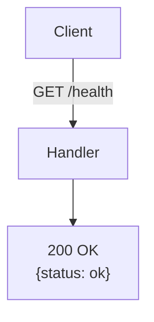
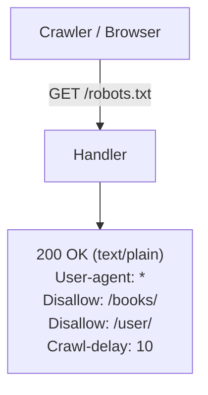
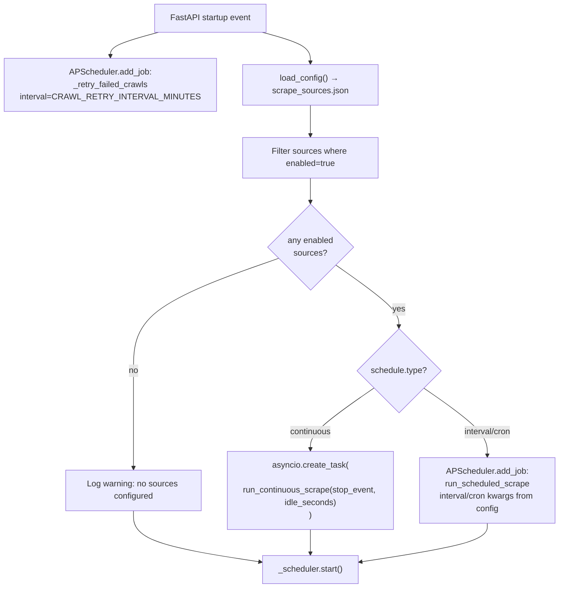
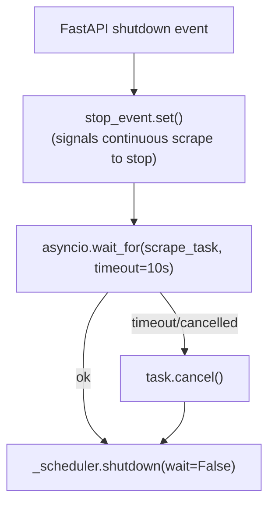

# System / Infrastructure API Flow Diagrams

---

## GET /health

Simple liveness probe.



---

## GET /robots.txt

Tells crawlers to stay out of `/books/` and `/user/`.



---

## GET /api/internal/book-list-cache (Honeypot)

Hidden endpoint. Real clients never hit this. Any public IP that calls it gets banned.

```mermaid
flowchart TD
    Client[Client] -->|GET /api/internal/book-list-cache| Handler
    Handler --> HoneypotEnabled{HONEYPOT_ENABLED?}
    HoneypotEnabled -- no --> ReturnEmpty["200 OK — []"]
    HoneypotEnabled -- yes --> GetIP["ip = request.client.host"]
    GetIP --> IsPrivate{_is_private(ip)?}
    IsPrivate -- yes, private subnet --> ReturnEmpty
    IsPrivate -- no, public IP --> BanIP["BANNED_IPS.add(ip)\n(in-memory set, checked by bot_guard_middleware)"]
    BanIP --> ReturnEmpty["200 OK — []\n(attacker not alerted)"]
```

**Note:** Returns 200 (not 403) intentionally — ban is silent so attacker doesn't know they were flagged.

---

## Startup: Scheduler Init



## Shutdown: Graceful Stop


