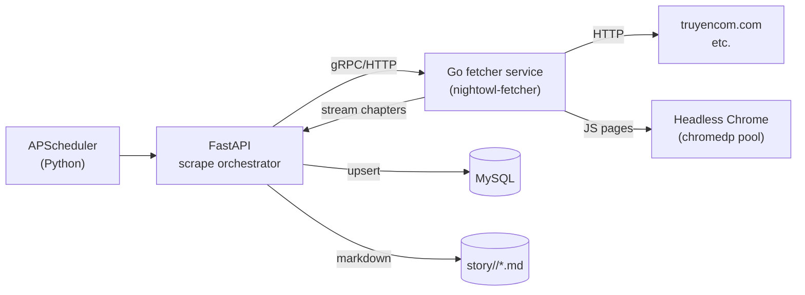

# Enhancement Plan — Speed Up Crawl Job with Go

## TL;DR

Bottleneck: Python crawl job (`app/scraper.py` + `app/scrape_job.py`) is IO-bound, blocked by browser overhead (Playwright/Patchright) and serial HTTP fetches. Add a **Go fetcher microservice** alongside the Python FastAPI app. Python keeps orchestration + DB writes; Go handles concurrent HTML fetch+parse (and headless Chrome only when JS rendering is required).

Expected gain: **5–10× throughput** on listing+chapter crawls. Memory drops too (no Python+Playwright fork-bomb).

---

## Language Decision: Go

### Why Go (not Rust / Node / pure-Python optimization)

| Option | Concurrency | Dev speed | HTML/HTTP libs | Deploy | Verdict |
|--------|-------------|-----------|----------------|--------|---------|
| **Go** | Goroutines, cheap (KB each), 1000s parallel | Fast, simple | `colly`, `goquery`, `chromedp`, `fasthttp` | Single static binary | ✅ Best fit |
| Rust | Tokio async, fastest raw perf | Steep curve, slow dev | `reqwest`, `scraper` | Single binary | Overkill, dev cost too high |
| Node.js | Single-thread + worker_threads | Fast, native Playwright | `cheerio`, `playwright` | Needs Node runtime | GC pauses, single-thread limit |
| Python (optimized) | `asyncio` + `httpx` | Familiar | Already use | No change | Lower ceiling; browser overhead remains |

**Pick Go because:**
1. Goroutine model maps perfectly to "fan-out hundreds of HTTP fetches".
2. `goquery` + `colly` give 80% of crawl needs without a browser.
3. `chromedp` available when JS rendering is unavoidable (replaces Playwright/Patchright).
4. Static binary → trivial Docker sidecar, no virtualenv mess.
5. ~5× less memory than Python+Chromium per concurrent task.
6. gRPC/HTTP interop with Python is straightforward.

---

## Target Architecture



**Split of responsibilities:**
- **Python (unchanged-ish):** scheduling, DB upserts, markdown post-processing, BOOK_META, retry tracking, FastAPI APIs.
- **Go fetcher (new):** concurrent listing crawl, chapter list crawl, chapter content fetch+convert HTML→Markdown, JS rendering via chromedp when needed.

---

## ADR-001: Use Go for the fetcher service

### Status
Proposed

### Context
Current crawl path uses `requests` + `BeautifulSoup` for static pages and `crawl4ai` (Playwright) for JS pages, all single-process inside the FastAPI server. Listing crawls of 50–100 stories take many minutes; the Python GIL + Chromium per-tab memory caps practical concurrency at 2–4.

### Decision
Extract fetch + parse into a standalone Go service (`fetcher/`) communicating with Python over gRPC. Python remains the system-of-record and orchestrator.

### Alternatives Considered
- **Pure-Python `asyncio` rewrite** — buys 2–3× but doesn't fix browser memory or GIL.
- **Rust** — best raw perf, but team velocity drops; not justified for IO-bound work.
- **Move everything to Go** — too risky; FastAPI app has comments, TTS, auth, etc. Rewrite cost ≫ benefit.

### Consequences
- ✅ True parallel fetch, ~5–10× throughput.
- ✅ Memory savings; Go static binary <20MB vs Python venv + Playwright.
- ✅ Chrome pool managed by chromedp, isolated from API process.
- ❌ Two-language operational surface (Python + Go).
- ❌ Need gRPC/proto schema maintenance.
- ❌ Local dev needs Go toolchain.

### Trade-offs
Accepts polyglot complexity for major throughput + memory wins on the slowest part of the system.

---

## Implementation Plan

### Phase 0 — Baseline & Contract (Day 0–1)

- [ ] **0.1** Measure current baseline: crawl 1 listing page (50 stories) end-to-end. Record wall-clock, MySQL upsert time, memory peak.
- [ ] **0.2** Identify which pages need JS (Playwright) vs static (`requests`). Audit `scraper.py` — list the selectors actually used.
- [ ] **0.3** Lock the fetch contract: input = `{url, render_mode: static|js, selectors?: [...]}`; output = `{title, chapters: [{title, url, content_md}]}` or stream.

### Phase 1 — Go Fetcher Skeleton (Day 2–4)

- [ ] **1.1** Create `fetcher/` Go module:
  ```
  fetcher/
    cmd/server/main.go
    internal/
      fetch/   # http client + retry/backoff
      parse/   # goquery selectors per source
      render/  # chromedp pool for JS pages
      proto/   # generated gRPC stubs
    Dockerfile
    Makefile
    go.mod
  ```
- [ ] **1.2** Define `proto/fetcher.proto`:
  ```proto
  service Fetcher {
    rpc FetchListing(FetchListingReq) returns (stream StoryRef);
    rpc FetchStory(FetchStoryReq) returns (stream Chapter);
  }
  message Chapter { string title=1; int32 number=2; string url=3; string content_md=4; }
  ```
- [ ] **1.3** Implement HTTP client with: rotating User-Agent, exponential backoff, per-host concurrency limit (`golang.org/x/sync/semaphore`), jitter.
- [ ] **1.4** Implement HTML→Markdown converter (`github.com/JohannesKaufmann/html-to-markdown`).

### Phase 2 — Static Page Parsing (Day 5–7)

- [ ] **2.1** Port `_collect_story_urls_from_listing` to Go (`internal/parse/listing.go`) using goquery + the same CSS selectors.
- [ ] **2.2** Port chapter list extraction (`_collect_chapters_for_story`) to Go.
- [ ] **2.3** Port chapter content extraction + markdown conversion.
- [ ] **2.4** Unit tests on saved HTML fixtures (golden files in `fetcher/testdata/`).

### Phase 3 — JS Rendering via chromedp (Day 8–10)

- [ ] **3.1** Pool of N chromedp contexts (env `CHROME_POOL_SIZE=4`).
- [ ] **3.2** Per-request: navigate, wait for selector, dump HTML, recycle context every 50 requests (avoid leak).
- [ ] **3.3** Fallback path: if static parse returns empty, escalate to JS render.
- [ ] **3.4** Benchmark vs current Playwright path.

### Phase 4 — Python Client Integration (Day 11–13)

- [ ] **4.1** Add `grpcio` + generated stubs to `requirements.txt`.
- [ ] **4.2** New module `app/fetcher_client.py` — async gRPC client wrapping `FetchListing` / `FetchStory` streams.
- [ ] **4.3** Refactor `app/scraper.py`: keep public surface (`scrape_story`, `_collect_story_urls_from_listing`) but route through Go client. Old Playwright path stays as feature-flagged fallback (`USE_GO_FETCHER=false`).
- [ ] **4.4** Streaming consumer: as Go streams chapters, Python writes markdown files and queues DB upsert.

### Phase 5 — Concurrency & Backpressure (Day 14)

- [ ] **5.1** Tune per-host semaphore on Go side (start 4, ramp).
- [ ] **5.2** Add jitter (1–3s) between requests to same host (anti-bot).
- [ ] **5.3** Add gRPC deadline (60s/chapter) + retry on UNAVAILABLE.
- [ ] **5.4** Python orchestrator caps in-flight stories (asyncio.Semaphore) to avoid overwhelming MySQL.

### Phase 6 — Observability (Day 15)

- [ ] **6.1** Prometheus metrics from Go: `fetch_duration_seconds`, `fetch_errors_total{type=}`, `chrome_pool_in_use`.
- [ ] **6.2** Structured JSON logs (Zerolog), correlation ID per crawl job.
- [ ] **6.3** Python side: log throughput (stories/min, chapters/min) before vs after.

### Phase 7 — Deployment (Day 16–17)

- [ ] **7.1** Dockerfile for Go service (multi-stage, scratch base, ~15MB).
- [ ] **7.2** Update `docker-compose.yml`: add `fetcher` service, expose gRPC :50051 on internal network.
- [ ] **7.3** Update `nightowl.service` to start fetcher (or run as sibling systemd unit `nightowl-fetcher.service`).
- [ ] **7.4** `.env.example`: add `FETCHER_HOST=localhost:50051`, `USE_GO_FETCHER=true`, `CHROME_POOL_SIZE=4`.

### Phase 8 — Rollout (Day 18–19)

- [ ] **8.1** Shadow mode: run both paths, diff results on 20 stories. Investigate mismatches.
- [ ] **8.2** Flip `USE_GO_FETCHER=true` for `/crawl/category` first (single endpoint blast radius).
- [ ] **8.3** Monitor for 48h: fetch error rate, MySQL load, memory.
- [ ] **8.4** Flip remaining `/crawl`, scheduled jobs.
- [ ] **8.5** Remove Playwright fallback once stable for 1 week.

---

## Risks & Mitigations

| Risk | Likelihood | Impact | Mitigation |
|------|-----------|--------|------------|
| Anti-bot detection picks up on Go HTTP fingerprint | Medium | Crawl breaks | Rotate UA; reuse existing header set from Python; keep chromedp fallback |
| Selector drift on source site | Low | Wrong data | Golden fixtures in CI; alert when extraction yields empty |
| gRPC streaming complexity (backpressure, half-close) | Medium | Hangs | Use deadlines + KeepAlive; load test with `ghz` |
| Two-language ops burden | Medium | Slow new-dev onboarding | Single Makefile target (`make crawl`); document in `CLAUDE.md` |
| Chromedp memory leak under load | Medium | OOM | Recycle context every N pages; cap pool size |
| Failure of fetcher service → all crawls stop | High if no fallback | Outage | Keep `USE_GO_FETCHER=false` flag; auto-fallback to Python path on connection error |

---

## Acceptance Criteria

- Listing crawl of 50 stories: **≤ 60s** wall-clock (current baseline ~5–10min).
- Single story (200 chapters): **≤ 30s** for static, **≤ 90s** for JS pages.
- Memory: fetcher service ≤ 300MB resident with `CHROME_POOL_SIZE=4`.
- Zero data-quality regressions vs Python path (shadow-mode diff = 0 on 20-story sample).
- p99 fetch error rate ≤ 1% over 24h.

---

## File/Folder Touch List

**New:**
- `fetcher/` (Go module, full structure above)
- `app/fetcher_client.py`
- `proto/fetcher.proto`
- `enhancement/crawl-speedup-go.md` (this file)

**Modified:**
- `app/scraper.py` — route through fetcher client when flag on
- `app/scrape_job.py` — same
- `docker-compose.yml` — add fetcher service
- `nightowl.service` — start order if systemd
- `.env.example` — new vars
- `requirements.txt` — `grpcio`, `grpcio-tools`, `protobuf`
- `CLAUDE.md` — link to this plan + new commands (`make fetcher-run`, `make proto-gen`)

---

## Open Questions (resolve before Phase 1)

1. **gRPC vs HTTP/JSON?** Recommend gRPC for streaming + codegen. HTTP is simpler but loses streaming. **Decision needed.**
2. **Where does markdown post-processing live?** Go side (faster, but duplicates `_clean_chapter_content`) or Python side (single source of truth). **Recommend Python** for now.
3. **Source-specific selectors:** keep in Go config (`fetcher/sources.yaml`) or pass from Python per request? **Recommend config in Go**, mirroring `scrape_sources.json`.
4. **chromedp pool size**: start at 4? Depends on host RAM. Confirm production VM specs.

---

## Next Step

Approve plan → start Phase 0 baseline measurement (~half day).
