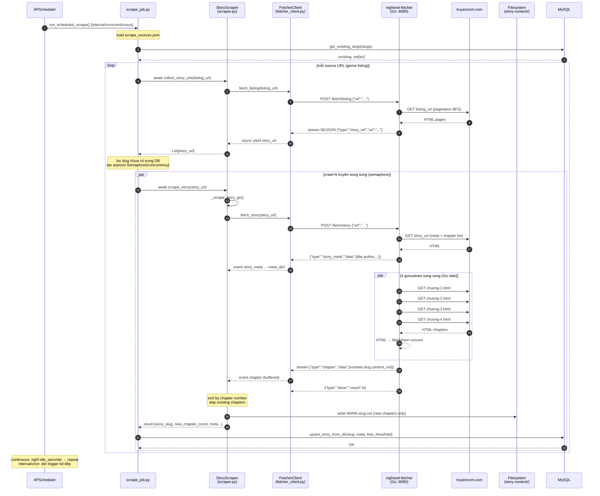

# Go Fetcher — Job Sequence & Trade-off Analysis

## 1. Tổng quan kiến trúc

```
┌─────────────────────────────────────────────────────┐
│                   FastAPI Process                   │
│                                                     │
│  APScheduler ──► scrape_job.py ──► scraper.py       │
│                                        │            │
│                              USE_GO_FETCHER?        │
│                             /            \          │
│                    Python path          Go path     │
│                  (crawl4ai/            fetcher_     │
│                  Playwright)           client.py    │
│                                            │        │
└────────────────────────────────────────────┼────────┘
                                             │ HTTP NDJSON
                                    ┌────────▼────────┐
                                    │  nightowl-      │
                                    │  fetcher (Go)   │
                                    │  :8080          │
                                    └────────┬────────┘
                                             │ HTTP
                                    ┌────────▼────────┐
                                    │  truyencom.com  │
                                    └─────────────────┘
```

---

## 2. Sequence Diagram — Go Fetcher Path



---

## 3. Data Flow Chi Tiết

### 3.1 Listing crawl (collect_story_urls)

```
scrape_job.py
  └─ StoryScraper.collect_story_urls(listing_url)
       └─ [USE_GO_FETCHER=true]
            FetcherClient.fetch_listing(listing_url)
              POST /fetch/listing → Go service
                Go: BFS qua tất cả trang /trang-N/
                Go: stream story_ref NDJSON
              async for story_url in stream
            return List[str]          ← dedup, sorted
```

### 3.2 Story crawl (_save_story_go)

```
StoryScraper._save_story_go(story_url)
  ├─ FetcherClient.fetch_story(story_url)
  │    POST /fetch/story → Go service
  │      Go: GET story_url → parse meta (title/author/genre/cover)
  │      Go: BFS chapter list → 4 goroutines fetch content
  │      Go: HTML → Markdown (html-to-markdown)
  │      Go: stream story_meta + chapter events
  │
  ├─ event "story_meta"  → meta_dict
  ├─ event "chapter"     → buffer nếu number chưa có trên disk
  ├─ event "done"        → done_count
  │
  ├─ sort buffered chapters by number
  ├─ write story-content/<slug>/NNNN-slug.md
  └─ return {story_slug, new_chapter_count, status, ...meta}
```

### 3.3 DB upsert (trong scrape_job)

```
scrape_job._scrape_source()
  └─ run_in_threadpool(upsert_story_from_dir, slug,
                       free_chapter_threshold, source_url,
                       story_name, story_author, ...)
       MySQL: INSERT/UPDATE books + chapters
```

---

## 4. Lợi Thế

### ⚡ Throughput

| Metric | Python path | Go path |
|--------|------------|---------|
| Chapter fetch concurrency | 1 (serial Playwright) | 4 goroutines/story × N stories |
| Listing crawl | Serial HTTP | BFS concurrent, semaphore-limited |
| Memory/chapter | ~150MB (Chromium) | ~2MB (Go HTTP) |
| Startup overhead | 2–4s/story (browser init) | ~0ms (persistent HTTP pool) |

Ước tính: **5–10× throughput** trên listing crawl; **3–5×** trên chapter content (trang static).

### 🔒 Isolation

- Go service chạy process riêng → crash Go không crash FastAPI
- `USE_GO_FETCHER=false` → fall back Python ngay lập tức, không sửa code
- FastAPI giải phóng event loop trong khi Go fetch → API response không bị block

### 🛠 Operability

- Go binary tĩnh ~9MB, không cần virtualenv
- `start.sh` auto-detect Go path, auto-rebuild khi source thay đổi
- Metrics/log tách biệt theo service (zerolog JSON)

---

## 5. Bất Cập & Rủi Ro

### 5.1 Chapter content chưa chính xác với trang JS-heavy

Go service fetch **static HTML** — không chạy JavaScript.  
Nếu `truyencom.com` render nội dung bằng JS (AJAX), selector `div.chapter-content` trả về rỗng.

**Triệu chứng**: `new_chapter_count > 0` nhưng file `.md` chỉ có heading, nội dung trống.  
**Mitigation hiện tại**: Python path còn nguyên, tắt `USE_GO_FETCHER` để dùng Playwright.  
**Long-term**: Phase 3 enhancement — thêm chromedp pool vào Go service.

### 5.2 Chapters buffer toàn bộ trong RAM trước khi ghi disk

`_save_story_go` nhận tất cả chapter events → buffer list → sort → ghi.  
Story 6976 chapters × ~10KB = ~70MB RAM/story.  
Với `concurrency=2` song song = ~140MB RAM peak.

**Mitigation**: Giảm concurrency trong `scrape_sources.json` nếu RAM hạn chế.

### 5.3 Thứ tự file phụ thuộc vào existing_file_count

File numbering dùng `existing_file_count + 1` làm prefix.  
Nếu chạy 2 job song song cùng story → race condition trên file count → trùng tên file.

**Mitigation**: APScheduler dùng `AsyncIOScheduler` đơn luồng; scrape_job có `asyncio.Semaphore(concurrency)` → không song song cùng story trên 1 process. Tuy nhiên nếu chạy 2 instance server = race thật.

### 5.4 Go service là single point of failure khi USE_GO_FETCHER=true

Nếu Go service down → tất cả crawl fail với `httpx.ConnectError`.  
**Mitigation hiện tại**: Error bị bắt tại `_scrape_source`, log warning, tiếp tục story kế.  
**Thiếu**: Chưa có auto-fallback về Python path khi Go unreachable.

**Recommended fix** (thêm vào `fetcher_client.py`):
```python
async def health(self) -> bool: ...  # đã có

# Trong scraper.py _save_story_go:
if not await self._get_fetcher().health():
    return await self._save_story(story_url, self._collect_chapters_for_story(story_url))
```

### 5.5 Hai ngôn ngữ = overhead vận hành

Developer mới cần biết cả Go lẫn Python để debug toàn stack.  
`start.sh` giảm bớt nhưng không loại bỏ hoàn toàn.

---

## 6. ADR-002: HTTP/NDJSON thay vì gRPC

### Status
Accepted

### Context
Enhancement plan ban đầu đề xuất gRPC streaming. Cần cân nhắc với HTTP/NDJSON.

### Decision
Dùng HTTP/NDJSON streaming (Go `net/http` + `json.Encoder` + `http.Flusher`).

### Alternatives Considered
- **gRPC streaming** — codegen mạnh, typed, backpressure built-in. Nhưng cần `protoc`, stubs phải sync 2 bên, debug khó hơn.
- **WebSocket** — bidirectional không cần thiết cho use case 1 chiều.

### Consequences
- ✅ Không cần protoc, Python client chỉ cần `httpx`
- ✅ Dễ debug bằng `curl`
- ✅ Python `async for line in resp.aiter_lines()` là streaming thật
- ❌ Không có backpressure tự động — Go có thể produce nhanh hơn Python consume
- ❌ Không có schema validation tự động như Protobuf

---

## 7. Checklist Vận Hành

```
□ Go service running:  curl http://localhost:8080/health
□ .env set:            USE_GO_FETCHER=true, FETCHER_HOST=http://localhost:8080
□ scrape_sources.json: enabled=true, target_count, concurrency
□ FastAPI restarted sau khi thay đổi .env
□ Monitor: grep "chapter fetch failed" trong log → chỉ báo trang JS-heavy
□ Monitor: grep "story_count" trong log → throughput/vòng
```
